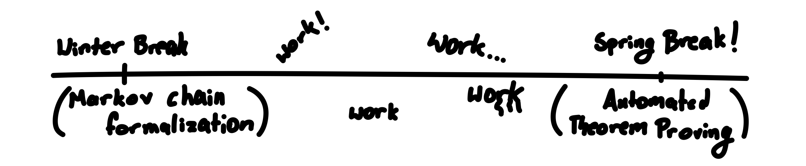

[Consider](https://www.math.cmu.edu/~gautam/c/2026-269/midterm1.pdf) trying to
solve a problem like the following:

**Problem.** Let \( a \in \R^d \), and \( C \subseteq \R^d \) be a non-empty,
closed set. Prove that there exists some \( x^* \in C \) such that
\[
    |x^* - a| = \inf \{ |x-a| : x \in C \}
.\]

How do you approach such a problem? Ideally, you have some context: some formal
understanding of what the definitions are (i.e. you know what a closed set and
infimum are), and some informal intuition for what the problem statement is actually
saying (in a closed set, there is always some point that achieves the smallest
distance to some other point).

Okay, let's suppose we have this context. Have you made any progress...?

Even with proper context, *mathematics is hard*; you may not be able
to produce all the steps to go from a point A to a very faraway point B. One of
reason for this is that there are so many tools (theorems, propositions, etc.)
at disposal and so many ways for these tools to work together. We don't need all
of these tools. If you somehow **knew which tools to use** then, with a little bit
of cleverness and patience, you could turn a needle-in-haystack search to a game
of fitting puzzle pieces together. Indeed, you could roughly chain together the
conclusion of one theorem with the hypothesis of another to eventually arrive at
the statement that you wanted.

Of course, this notion of a tool or **dependency** is a little fuzzy. Even the
definition of say, a real number or subtraction, depends on everything from
sequences and rational numbers to set theoretic axioms. By a tool, I really mean
direct dependencies, whatever you'd usually see written in a proof of the
theorem. If a proof of this problem were written down, you indeed probably
wouldn't see mention to any of these minute things; they're ambient and shadowed
under powerful definitions. With this in mind, let me tell you what dependencies
we'll need (in some random order):

1. (Bolzano-Weierstrass) A closed and bounded subset of \( \R^d \) is compact
2. The intersection of a closed set and a closed set is closed.
3. For any sequence in a compact set, there exists a convergent subsequence with
   the limit in that compact set.
4. (Squeeze) If a sequence lies between two sequences that converge to the same
   limit, then that sequence converges to that limit.
5. The Euclidean metric is continuous.
6. (Infimum property) Suppose \( \ell = \inf A \). Then, if \( x > \ell \), there
   exists some \( a \in A \) such that \( a < x \).
7. If \( x_n \to x \) and \( f \) is continuous, then \( f(x_n) \to f(x) \).

This definitely gives us a much better starting point. Of course, experience
still matters here (and some geometric intuition is probably helpful too), but
even just reading these, one can do some meta-reasoning and piece theorems
together. For example, we're trying to output some point \( x^* \), so it's
likely that it will be outputted by some some convergent sequence. We see that
the Euclidean metric is continuous and continuous functions can be passed
through sequences, so we'll probably be passing the metric through a sequence.
Since we're trying to find some sequence converging to our point, we'll likely
need to find a compact set (maybe take a bounded subset of \( C \)?).

Indeed, with enough filling in of gaps, one could probably arrive at a proof
like the following (slightly verbose for the sake of pedagogy):

Proof

Set \( \ell := \inf \{ |x - a| : x \in C \} \), and let \( C' :=
\overline{B(a,\ell + 1)} \cap C \). Note that \( C' \) is bounded (it is
contained in a ball of finite radius), and by (**2.**) it is closed.

Observe that for all \( n \ge 1 \), \( \ell + 1/n > \ell \), so there exists
some \( r \in \{ |x-a| : x \in C \} \) such that \( r < \ell + 1/n \).
Consequently (by set definitions), there exists some \( x \in C \) such that
\( |x - a| < \ell + 1/n \) by (**6.**). Since \( \ell + 1/n \le \ell + 1 \), \(
x \in C' \) too. Now, set \( x_n := x \) (essentially, we are creating a
sequence of these such points for each \( n \)). 

By (**1.**), \( C' \) is compact since it is closed and bounded. Since \(
(x_n)_n \) is a sequence in \( C' \), by (**3.**) there exist some subsequence of
it, \( (x_{n_k})_k \), that converges, i.e. \( x_{n_k} \to x^* \in C' \). Note
that by (**5.**) and (**7.**), \( |x_{n_k} - a| \to |x^* - a|  \). Since \( \ell
\le |x_{n_k} - a| \le \ell + 1/n_k \le \ell + 1/k \), we have that both sides of
the inequality converge to \( \ell \), so by (**4.**), we get that \( |x^* - a|
= \ell \). This is what we wished to show.

Note that there were several slightly different routes we could have taken. We
could have instead used something like the extreme value theorem to provide a
minimum distance point. This being said, the proof and what it used would be
roughly the same. In an informal sense, our direct dependencies are robust
against small changes to paths in proofs; the dependencies in the list were
still **relevant** and gave us clues into how the proof follows.

## The Main Problem

I hope you'll excuse the rather long example (I also wanted to share a problem I
rather liked!). This article, as the title suggests, is about three subjects:
Lean, Markov chains, and automated theorem proving. The example above is
relevant to the latter of those topics. Automated theorem proving is a rapidly
growing field and has recently become one that I've been interested in. Seeing
projects such as [AxiomMath](https://axiommath.ai/),
[Canonical](https://github.com/chasenorman/CanonicalLean), and others was really
exciting! I wanted to make something similar or at least understand how they
work. I don't believe AI or machine learning systems will replace
mathematicians, but rather empower them and help us work on a higher level.

Nowadays, I see a lot of automated theorem proving systems (like those above)
take on the burden of finding an entire proof. These systems are amazing, but
the task of creating them seems rather daunting without being able to talk to
experts and decipher what everything means. Thus, I came up with a slightly more
reduced idea for an automated theorem proving system.

The key insight for my automated theorem proving system as well as the above
example is that, **given the pieces of a puzzle, mathematicians are certainly
able to fit them together, so why not focus machine learning on finding these
pieces?** Given the conclusion (and perhaps other parts of a theorem), one can
find theorems of similar structure and **relevance** using statistical methods,
and these can be outputted to the human. Since such theorems are relatively
robust even to some changes in the theorem structures, this is a decent metric
and a way to empower human mathematicians with machine learning methods. This
also differs from traditional methods like `apply?` or `simp?` in that it uses
statistical reasoning and pruning as opposed to just brute force search.

To describe the plan a bit less vaguely, I want to take the set of theorems I
know about (possibly in a custom project or Mathlib), \( D \), and do the
following:

1. Extract the theorem information (perhaps the AST of the conclusion as a tree and other information like dependencies) via a map \( f : D \to \mathcal{T} \),
2. Embed this information into a high-dimensional vector space via a map \( E :
   \mathcal{T} \to \R^d \),
3. Train a bilinear form \( W \in \R^{d \times d} \) so that for \( t_1, t_2 \in
   \mathcal{T} \), one can compute a similarity score via \( E(t_1)^T W E(t_2) \),
4. Given a fixed \( t_1 \) (representing the theorem that we're trying to
   prove), compute the similarity across all \( t_2 \) and compute some
   activation of these scores to get a list of confidence levels for how
   relevant each theorem is to \( t_1 \), and
5. Take the \( k \) most relevant theorems and output them to the user.

There's a lot to talk about and a lot I'm excited about, so I hope you enjoy the
journey through Lean, Markov chains, and of course the WIP
automated theorem proving system described above. Thank you in advance for
reading!

## Preface and Bookkeeping

Welcome back everyone! It's definitely been a little bit since the publishing of
the last article (due to the good ol' CMU workload), but I'm gradually
getting better at balancing work for college and work for myself (like this
blog!). If not articles with much handholding, then definitely expect more
technical articles with interactive components. At least, this is my hope, as
often single ideas compound into projects with bigger and bigger scopes. In
fact, this is precisely what happened to this article (see below).

</img>

Yeah, so it turns out I actually started the first component of this project (the
Lean formalization of Markov chains) in January during winter break. I had
originally intended to finish writing up a blog for it during winter break as
well, but I ended up losing the battle to the warm, inviting, dangerous sirens
(my bed). It was only later during the time leading up to spring break that I
became interested in automated theorem proving and related methods and
realized that some of the experience and work in the winter break project could
be used.

Largely, I view the concept of this project in three main parts, and I shall
organize this article accordingly:

1. **The Lean component**. In order to explain this properly, I'll give a brief
   introduction to what Lean is, why one should care, and my impressions working
   with Lean in the project.
2. **The Markov chain component.** Here, I give a bit of motivation for
   why I feel inspired to work on Markov chains (largely due to a great
   professor at CMU). In line with some remarks in the previous section, I
   present a somewhat hacky, somewhat cool proof to sidestep much of the
   difficult details of the Perron-Frobenius theorem.
3. **The automated theorem proving component.** This is the component that I
   envisioned closer to spring break. I start with some motivation for the idea
   and offer the explanation and results of the first part of the automated
   theorem proving process: gathering data. Further, I discuss the machine
   learning component involved (this is a work in progress, but I'm excited to
   see how things turn out!).

As sorta per usual, you can find relevant code on my Github
([here](https://github.com/chirprush/lean-markov-chains/)) under the MIT
license.

## Motivation for Lean

[Lean](https://lean-lang.org/) is most commonly known as a language which allows
you to interactively prove and state theorems. Recently, the language has gained
a lot of backing, with popular projects such as
[PNT+](https://github.com/AlexKontorovich/PrimeNumberTheoremAnd)
and the [Liquid Tensor
Experiment](https://github.com/leanprover-community/lean-liquid) being written
and popular names such as Terence Tao, Jeremy Avigad, and Alex Kontorovich
endorsing it.

To give you a taste of what some Lean code looks like, here's a theorem in the
project along with proof. This states that that a (discrete) probability
distribution has at least one entry with positive probability. It is done via a
proof by contradiction. Indeed, the negation of the conclusion (stored in `h`),
is that `\forall x, p.\pi x \le 0`. Combined with the fact that probabilities
are nonnegative, this implies that all the probabilities are zero, which implies
that the sum of all the probabilities is zero. This contradicts the fact that
probabilities sum to one.

lean

<pre class="code-body">
theorem has_pos_entry (p : ProbDistribution α) : ∃ x, p.π x > 0 := by
  by_contra h
  simp only [gt_iff_lt, not_exists, not_lt] at h
  have h0 : ∀ x, p.π x = 0 := by
    intro x
    linarith [h x, p.nonneg x]
  have hsum : ∑ x, p.π x = 0 := by
    simp [h0]
  absurd hsum
  simp [p.sum_one]
</pre>

Especially being at CMU, one hears about Lean all the time, and I was naturally
curious about it. Thus, I decided it would be fun to try and do some hands-on
learning over winter break by creating a project in Lean. I ended up choosing to
formalize Markov chains in Lean (see later on why this choice). It turns out
that this was a good choice for a subject, as the subject seems to be decently
amenable to proofs in Lean.

### Learning Lean?

But of course, this is jumping ahead in the narrative (tsk tsk we can't have
that). At the point in time I decided to build something in Lean, I hadn't ever
touched a theorem prover before. In fact, I didn't really have much of a clue
what was going on in a theorem prover, how to use them, or how I should
structure my approach towards a decent sized project. It seemed there was only
one thing to do: a **deep dive**! I'm going to show just about everything I
read and watched before going in and trying to build something. In retrospect,
although I definitely learned the most from writing the actual project (the
process of trying and failing again is universally important), the process of
the deep dive was still helpful for motivation, breadth of knowledge, and
finding a starting point. My hope is that some of these resources or this path
as a whole will interest or help others reading this.

One of the simplest things you can do is just Google `learn lean programming
language` or `learn lean 4` (typing just "Lean" often yields undesired results;
also, beware that Lean had quite a view changes from version 3 to 4, so make
sure you are looking at up-to-date resources). Perhaps one of the first things
you'll run into is the aptly named [Learning Lean
4](https://leanprover-community.github.io/learn.html) guide. They have some nice
resources, including the [Natural Number
Game](https://adam.math.hhu.de/#/g/hhu-adam/NNG4), but it might look a little
overwhelming for a beginner and might not be what you're looking for if you're
eager to jump into an actual project. I hold a similar opinion for [Mathematics
in Lean](https://leanprover-community.github.io/mathematics_in_lean/index.html).
In general, resources like the above are nice, but only if you have a base
understanding of syntax and the existence of things called tactics.

When I learn something new, I like knowing, at least at a high level, what is
going on under the hood; this makes it easier to understand what's going on when
things break and infer new patterns on the fly. Thus, I prioritized finding
sources that didn't dumb things down too much. One resource that I found a
little bit more traction with was [Theorem Proving in Lean
4](https://lean-lang.org/theorem_proving_in_lean4/). The introduction alone
helped clarify the type system, how some of the proof logic works, and how Lean
works/looks as a programming language (more on Lean as a programming language
later).

If I really had to take away one thing from Theorem Proving in Lean 4 besides
syntax, it would absolutely be the [**Curry-Howard
correspondence**](https://en.wikipedia.org/wiki/Curry%E2%80%93Howard_correspondence).
This forms the main basis of why proofs in Lean actually work. The idea of the
correspondence is that propositions, such as `x = x`, can just be thought of as
parameterized types. The proof of such a proposition, then, become
a program of that type. Chaining programs together then equates to chaining
results and theorems together. Certain moves called **tactics** also exist as
encapsulated tools to help you prove theorems and chain these programs together
in different ways (certain tactics like `simp` can even suggest theorems to
you). Of course, this is fuzzy and informal, but I highly recommend that you
check it out. It's super cool and
[relevant](https://www.cs.cmu.edu/~fp/papers/jacm00.pdf) outside of just theorem
provers. One resource I found later that helped with the intuition for the type
system described above was [this
playlist](https://youtube.com/playlist?list=PLFMMwXV6jh1QZhEgJE-LhlmHQWzyP0GPe&si=KRmbjFmWBRhe1O3o)
of short videos on homotopy type theory (a scary bunch of words for a subject
with elegant and simple core ideas).

Another avenue for learning I don't see often talked about online is watching
someone else learn, struggle, and share their thoughts *in real time*. I don't
mean watching them in-person (unless you are indeed fortunate to have someone
like this), but rather on some site like Youtube or Twitch. This has always been
something that's helped me engage in learning (I learned a decent bit of
functional programming and Linux knowledge from people like Tsoding by watching
streams), and it might be something to explore if you don't really like the
tutorials written online. In particular, I really liked some of the below videos
by Evan Chen:

- Formalizing [USAMO 2003 Problem 5](https://youtu.be/7AF_ekJfk30?si=3oRZ7PumR0owpmRK)
- Formalizing [USAMO 2014 Problem 3](https://youtu.be/LgS5UrQzXJI?si=VQU7xS8i7jtXVec3)
- Formalizing [USAMO 2002 Problem 4](https://youtu.be/JJubxpCN0fM?si=RrvHD_Yh6zmRIvxn)

Evan Chen is insanely smart, but even he struggles with Lean sometimes, which is
at the very least good for motivation when things don't seem to make sense. I
like this live sort of style because you can at least poke into someone's train
of thought and see how they came to form ideas for what to try, what's broken,
etc. Also, you get to ~~steal~~ professionally and academically borrow the
specific tactics and conventions they use. For example, I didn't know about the
`choose` tactic until watching one of the above videos.

Other miscellaneous resources include [Loogle](https://loogle.lean-lang.org/)
and the [Mathlib
docs](https://leanprover-community.github.io/mathlib4_docs/index.html). LLMs,
while not the best at writing Lean, can also help you search for tactics that
you're better at explaining in natural language. Moreover, tactics like `apply?`
or `simp?` are often helpful for pointing you in the right direction.

Another resource that cannot go without mention is
[Zulip](https://leanprover.zulipchat.com/)! The community is super nice, and
it's always pretty cool to see actual giants in mathematics (Terence Tao, etc.)
talking in the forums about work.

### Actually Writing Lean

The learning experience was fun, but I was itching to actually put some of my
own code on the screen. Thus started the process of trial and error.

Before I jump into my commentary on working with the actual project, let me
clarify at least a little of what goes on when working with Lean. It's
particularly helpful if you write it inside a text editor that has proper
support (like neovim or VSCode) for its interactive component. Consider the
following situation (returning back to the code example above): you are trying
to prove that a probability distribution has at least one entry of positive
probability. Thus, it can be said that your initial **goal** is to show that
`\exists x, p.\pi x > 0` (where `p.\pi : \alpha \to \R` and `\alpha` is the type
over which we have a probability distribution). Our proof of this will look like
a series of tactics, one after the other, that each transform/simplify the goal
in some way until we have simplified it to something Lean can know is obviously
true.

lean

<pre class="code-body">
theorem has_pos_entry (p : ProbDistribution α) : ∃ x, p.π x > 0 := by
  by_contra h
  simp only [gt_iff_lt, not_exists, not_lt] at h
  have h0 : ∀ x, p.π x = 0 := by
    intro x
    linarith [h x, p.nonneg x]
  have hsum : ∑ x, p.π x = 0 := by
    simp [h0]
  absurd hsum
  simp [p.sum_one]
</pre>

For example, the `by_contra` tactic starts a proof by contradiction: it gives us
the hypothesis `h` as a variable that the conclusion isn't true, and it
transforms our goal to be proving `False` (i.e. we must prove absurdity, which
is precisely what a proof by contradiction is). Then, we simplify `h` a
little and then use the `have` tactic to initiate some subproofs that give us,
as variables, some absurd hypotheses. We then use these absurd results to prove
`False`, finishing the proof by contradiction.

Essentially, Lean turns theorem proving into a game by making a proof a series
of well-chosen moves. The interactivity offered by editors (showing what
hypotheses are currently in the environment and what the current goal is) are
downright essential to working well in Lean, and they are really cool and usable
from a software standpoint. One resource that's initially helpful when actually
trying to write with tactics is [this
cheatsheet](https://raw.githubusercontent.com/madvorak/lean4-cheatsheet/main/lean-tactics.pdf).
It doesn't contain all tactics, but it definitely has some of the more common
ones.

Thus, I started writing some Lean code. I wrote some basic definitions for
objects like Markov chains, probability distributions, irreducibility, etc. At
first the process was a bit grueling and slow. You somewhat have to carefully
think about what definitions you actually want to put and where, because this
dictates what theorems you'll be proving and in what sequence. This isn't too
bad for independent results, but it becomes a little bit more delicate when
tackling a whole field of results, like Markov chains.

In order to not have to deal with too much expensive backtracking and
second-doubting, I outlined the entire field of (initial) results that I wanted
to prove. To illustrate, I had a bunch of theorems that looked like this:

lean

<pre class="code-body">
theorem IsReversible.convergence_bound
  {M : MarkovChain α} {p : ProbDistribution α}
  (hIrred : M.IsIrreducible) (hAper : M.IsAperiodic)
  (hRev : M.IsReversible p) :
  ∀ t > 0, ∀ x y, ∃ C > 0, |((M.P ^ t) x y) / (p.π y) - 1| ≤ C * (1 - M.SpectralGap) ^ t := by
  sorry
</pre>

In other words, I had a bunch of somewhat complex looking results (the
conclusions of the theorems), but none of the actual proofs (the `sorry` tactic
is a funnily named one that just means the proof will be filled in later). The
outline ended up looking something like the following:

- `Basic.lean`: Basic definitions like Markov chains and probability
  distributions.
- `Irreducible.lean`: Results on irreducibility and reachability.
- `Period.lean`: Results on aperiodic Markov chains
- `Lazy.lean`: A simple transformation that makes chains aperiodic.
- `Reversible.lean`: Convergence results for reversible Markov chains.
- `Spectral.lean`: Spectral gap definition, and eigenvalue results for Markov
  chains.
- `StationaryDistribution.lean`: Existence and uniqueness results for stationary
  distributions of Markov chains under certain conditions.

Once the outline was finished, it was time to move to actually proving things.
This part was also accompanied by a big learning curve. However, once I got
decently competent in handling tactics and searching for them, the process
actually felt really fun! I think working with a proof assistant really helps
you hone your proof skills in catching edge cases and being clear in
assumptions. Moreover, the gamification of a proof makes it really satisfying to
see the `Goals accomplished!` message once you figure everything out. While
it may be nice to have the proof on paper before you write it in Lean, I also
found it a lot nicer to stay at the screen and keep the process in my mind. It
feels like the difference between writing a passage in English and translating
it into Spanish versus natively speaking in Spanish. The latter is harder to get
used to, but it feels much less clunky, especially since there are some nuances
unique to Spanish that don't always translate well when working with English.

The (mostly completed; I would like to return later and put in proofs for the
spectral results) end results are of course found on Github if the reader is
curious how the process went. If you look at the commit changes, you can see the
progression of what I worked on over time.

To conclude this section, I'll give some remarks on what I noticed while
working:

- Although the Lean docs are very helpful when you're trying to find specific
  results, there is also a lot more room for improvement in terms of
  documentation and explanations. Perhaps an effort could be made to comment
  more of Mathlib.
- To build more on the English versus Spanish analogy from before, writing in
  Lean using Mathlib is not quite the same as how you'd write things in regular
  mathematics; often you find yourself pulling for different kinds of machinery.
  While in mathematics we may use different conventions depending different levels
  of generality that you can easily refer to (because the reader will know
  what's going on and fill in the gaps), Mathlib usually has one very general
  tool for the job. For example, a mathematician writing on paper doing
  one-variable real analysis can refer to limits via the usual epsilon-delta
  definition without having the need for extra machinery that may clutter
  things. If you're working in a slightly more advanced setting, you might reach
  for some topological notion of a limit. When working with Mathlib, you use
  [Bourbaki's theory of
  filters](https://en.wikipedia.org/wiki/Filter_(mathematics)) for most
  everything. In Mathlib, to access matrix multiplication, you have to view
  matrices as an instance of an `HMul` and unravel its implementation of
  `HMul.hMul` (this is assuming the matrix element type `\alpha` provides `[Fintype \alpha] [AddCommMonoid \alpha]`). Luckily,
  most of this isn't directly straining the user (the compiler can figure most
  of the things out), but of course you can see it's still some more mental
  overhead than just writing on paper.
- As an explanation for the above, consider the following: in some sense, there
  is a greater opportunity cost to writing Lean code than writing math because
  while math ambiently exists in the universe of knowledge, Mathlib is a real
  library that needs to maintain modularity and readability. Adding another
  concept means defining that concept, connecting it to others through several
  theorems, and so on when one can really bundle this up in one general concept.
- One thing that is slightly unfortunate about instancing is that (at least for
  me), it's a little bit annoying sometimes to implement a second instance of a
  typeclass on a type. Ordinarily this wouldn't be a problem, but it turns out
  that some Markov chain results rely on this. In particular, if \( \pi \) is
  the stationary distribution of an irreducible, aperiodic, reversible Markov
  chain, then 
  \[
      \langle u, v \rangle_{\pi} = \sum_{x \in \alpha} \pi(x) u(x) v(x)
  \]
  is an inner product. Thus, \( \R^n \) forms an inner product space with
  respect to this product. Due to the [diamond dependency
  problem](https://jlbp.dev/what-is-a-diamond-dependency-conflict), you cannot
  directly add this instance to \( \R^n \) in Lean. Instead, you must create a
  type synonym, inherit all the necessary dependent instances by hand, and then
  implement your instancing of inner products. Anytime you want to go between
  inner product instances, you really have to go between whole types. This is a
  little unfortunate, but I see why it works like this. In a perfect world, I
  would imagine keeping everything the same except for adding some optional,
  lower priority instances that you can manually choose, but I'd imagine this
  would make other scenarios complicated.

## Markov Chains are (Really) Cool!

A little bit ago, I promised to tell you why I chose to formalize Markov chains
of all things in Lean. One obvious reason was because I hadn't seen any related
projects on Github, but I had also seen Markov chains in a new light over the
course of the fall semester due to my 21-242 professor, [Wesley
Pegden](https://www.cmu.edu/math/people/faculty/pegden.html). Traditionally (at
in my high school linear algebra class), the unit on Markov chains felt
composed of contrived examples (I don't think the weather truly follows a Markov
chain, guys), so I didn't understand the motivation behind them. It was only
until 21-242 (in which we took a long digression on Markov chains because Pegden
likes them) that I started seeing how powerful they could be when used properly.

The basic idea of Markov chains is as follows: you have some starting state and
each state has some probability of transitioning to one of the other states. For
very small state spaces, their behavior is almost a little trivial (this is in
part because you can simply compute the whole transition matrix and any powers
that you want). The real power of Markov chains lies in situations when the
state spaces are very large. In this case, you can only compute one or a few
evolutions of states, and the states themselves can represent rather complicated
objects. Another tenet of Markov chains is that, under certain conditions, any
Markov process always converges to a stationary distribution. The great thing
about Markov chains is that often we are able to select the *process itself*,
meaning we can choose a set of transitions that computes some process, perhaps
with a stationary distribution that gives us some information about the
underlying process.

A very surprising example of this was that Markov chains allow us to draw from a
distribution of bipartisan congressional districting maps. Pedgen was then able
to use this in a statistical test to [testify in front of Supreme Court](https://www.pubintlaw.org/wp-content/uploads/2017/06/Expert-Report-Wesley-Pegden.pdf) that a
certain state's district lines were gerrymandered. The reason why Markov chains
work so well as opposed to other methods is that the space of congressional
district arrangements are huge! I highly encourage those interested to read
further.

In order to properly formalize the theory of Markov chains, I had to first
actually be clear on what the theory of Markov chains contained. I had a small
idea of the basic map of results (irreducibility, aperiodicity, reversibility,
etc.) from 21-242, but I wanted to explore even more. For this, I referred to
the following two sources:

- [Markov Chains and Mixing
  Times](https://bookstore.ams.org/mbk-107#:~:text=This%20book%20is%20an%20introduction,reader%20of%20recent%20research%20developments.)
- [Gautam Iyer's Notes for 21-326: Markov Chains: Theory, Simulation, and
  Applications](https://www.math.cmu.edu/~gautam/c/2025-326/notes/index.html)

These are some pretty nice sources, and it turns out that Iyer is also my
professor this semester for 21-269. In these sources, I learned some nice proofs
for standard results like aperiodicity and irreducibility, but some of Pegden's
own proofs turned out to be far more amenable to Lean formalization.

Of course, while I was referring to the sources above for proofs, I was
certainly not copying their proofs line-by-line. It turns out that Lean
formalization still requires a decent degree of individual creativity to
sidestep certain problems and the quirks of Mathlib. One thing that massively
differed in my codebase from the sources was the organization of results.
In 21-242 and many other sources, the [Perron-Frobenius
theorem](https://en.wikipedia.org/wiki/Perron%E2%80%93Frobenius_theorem) is a
large theorem that gives you quite a few things under a few assumptions.
However, some of the results (such as a unique stationary distribution) were
already proved in other sections under roughly the same assumptions. Thus, I
reduced the power of the statement of Perron-Frobenius until it was no longer
redundant with other theorems. The end result, shown below, seems far easier to
prove now (indeed, all you need now is the extreme value theorem and a well
chosen compact set):

lean

<pre class="code-body">
lemma positive_exists_stochastic_eigenvector {P : Matrix α α ℝ}
  (hPos : P.IsPositive) (hRowSum : P.IsRowSumOne) :
  ∃ p : α → ℝ, (∀ i, p i ≥ 0) ∧ Matrix.vecMul p P = p := by
  sorry
</pre>

In particular, all we're saying is that if \( P \) is a stochastic, positive
matrix, there exists some stochastic eigenvector \( p \) with associated
eigenvalue \( 1 \). The fact that \( p \) is strictly positive comes from
another result on the stationary distribution of irreducible chains. Uniqueness
also comes from irreducibility and aperiodicity.

All that was really left was to show that the Perron-Frobenius eigenvalue
(specialized to \( 1 \) in this case) was the dominant eigenvalue. The Lean
statement was as follows:

lean

<pre class="code-body">
theorem irreducible_aperiodic_unique_max_eigenvalue {M : MarkovChain α}
    (hIrred : M.IsIrreducible) (hAper : M.IsAperiodic) :
    ∀ μ, M.HasEigenvalue μ ↔ μ = 1 ∨ ‖μ‖ < 1 := by
    sorry
</pre>

I thought long and hard about this, and I was worried that there wouldn't be a
good way to prove this (and thus I would have to go back to the whole drawing board
for Perron-Frobenius), but with some luck, I came up with another way to
sidestep this using only elementary results. Consider the following proof sketch
below:

Proof

Let \( \rho \) be an eigenvalue for \( P \) with eigenvector \( v \) (\( v \) can contain possibly complex entries). By
[here](https://github.com/chirprush/lean-markov-chains/blob/ea90eac19f1e55b927dc44873da2bb150949fa7a/LeanMarkovChains/Spectral.lean#L59),
for example, we know that \( |\rho| \le 1 \), so it suffices to show that if \(
|\rho| = 1 \), then \( \rho = 1 \). Suppose \( |\rho| = 1 \) so that we can write
\( \rho = e^{2 \pi i \alpha} \), where \( \alpha \) is a unique real number in \( [0,
1) \).

Since \( P \) is irreducible and aperiodic, there exists some power \( k \ge 1
\) such that \( P^k \) (and any successive power) contains strictly positive
entries. Choose \( \ell \) as follows:

- If \( \alpha \) is rational with \( \alpha = p / q \), then choose \( \ell \ge
  k \) that is coprime to \( q \).
- If \( \alpha \) is irrational, choose \( \ell = k \).

In both cases, \( \ell \ge k \), so \( A := P^\ell \) contains strictly positive
entries. Moreover, \( \rho^\ell = 1 \) would imply that \( \rho = 1 \) by how
we've chosen \( \ell \). Now, consider \( i \in \N \) that maximizes \( |v_i| \). By triangle inequality,
\[
    |v_i| = |\rho^\ell v_i| = |(A v)_i| = \left| \sum_{j = 1}^{n} A_{ij} v_j \right| \le \sum_{j = 1}^{n} A_{ij} |v_j|
.\]
Since \( A_{ij} > 0 \) for all \( j \) and \( A \) is stochastic, it follows
from maximality of \( |v_i| \) that \( |v_1| = |v_2| = \cdots = |v_n| \).
Moreover, the equality case of the triangle inequality tells us that each of \(
v_1, v_2, \ldots, v_n \) have the same argument. Thus, \( v_1 = v_2 = \cdots
= v_n \). Putting \( Av = v = \rho^\ell v \), we have \( \rho^\ell = 1 \), so \(
\rho = 1 \).

This resonates with what I wrote above about Lean code having a higher cost. It
is more economical to sidestep larger results by proving weaker results that,
when combined, give just enough for what you need. I feel that this is where the
creativity of working with theorem provers comes in. Theorem provers give us a
new perspective on how to tackle proofs, and it's really exciting to think about
where math could go with this as some fields move closer to computer formalization :)

## Trying a Hand at Automated Theorem Proving

I've kept you waiting long enough! It's time for some extrapolating. Leading up
to the course of spring break, I realized that not only could I formalize some
mathematical concept in Lean, but I could actually use this knowledge of the
language to go a bit further and make something in the lines of automated or
machine-assisted theorem proving. Let me outline how exactly this is possible.

While Lean is best known for its capabilities as a theorem prover, I want to
clarify that it is also a genuine [functional programming language](https://lean-lang.org/functional_programming_in_lean/) (like Haskell,
OCaml, Clojure, etc.) that you could make non-math-related programs with.
Indeed, the reason why Lean functions so well as a theorem prover is roughly due
to the fact that is a functional programming language with a very extensible
type system and macro system. One very cool application of this is that you can
code procedures as you would in any other programming language and then *prove
things about these procedures*. As an example, one can formalize [cryptography
proofs](https://github.com/Verified-zkEVM/VCV-io) and such in Lean. Another cool
thing I found out while coding some of the automated theorem proving component
is that if you don't label a recursive function as `partial` (a keyword to
indicate that the function may not be total, i.e. return on all inputs), the
Lean compiler itself will try to automatically prove that the function
terminates through inductive reasoning, and if it cannot prove as such it will
tell you.

The feature I'm going to take advantage of, in addition to the above, however,
is the fact that **the Lean programming language is written in Lean!** This means
that the language has first-class support for its [own
expressions](https://leanprover-community.github.io/mathlib4_docs/Lean/Expr.html#Lean.Expr)
within the language. For example, Lean represents `Lean.Expr` as just a simple
inductive (or sum) type. For simplicity, I'm going to prune some of the
irrelevant details (like metadata cases and some more complicated type system
stuff; they end up not mattering in my code either). Thus, the definition of an
expression looks roughly like the following:

lean

<pre class="code-body">
inductive Expr where
  | bvar (deBruijnIndex : Nat)
  | const (declName : Name)
  | app (fn : Expr) (arg : Expr)
  | lam (binderType : Expr) (body : Expr)
  | forallE (binderType : Expr) (body : Expr)
  | letE (type : Expr) (value : Expr) (body : Expr)
  | literalNum (n : Nat)
  | literalStr (s : String)
  | proj (idx : Nat) (struct : Expr)
</pre>

For those curious, `bvar` takes in what is called a [De Bruijn
index](https://en.wikipedia.org/wiki/De_Bruijn_index), but this is just some
programming language theory for representing variable bindings efficiently.
Constants, function applications, lambda expressions, universal quantifiers, let
expressions, and literals are pretty straightforward. Projections just mean
accessing elements of structures (like `p.\pi` accesses the `\pi` field of `p`).
Remarkably, the semantics are rather simple!

However, we can go much further. Whenever you compile a Lean project (to ensure
that all theorems check correctly), it gets stored in a subdirectory of the
`.lake` directory. Lean, in a separate process, can read the data and
information of this compiled program and compute with it. In other words, if I
have a project with a large array of theorems and definitions, I can write a
program in Lean to access these theorems (which are represented in the format
above as just expressions), iterate over them, process them, and basically do
whatever I want with them. I also can accessed other libraries that have been
imported within the project. It turns out the process of doing all of this is
rather simple and abstracted away in a few handy functions of the standard
library.

Thus, the following plan emerged:

- Collect all the theorems defined locally in the project, and for each theorem
  collect its dependencies (i.e. constants names that correspond to theorems).
  Call these the *user theorems*, denoted by \( \mathcal{U} \).
- Collect most (all, if it is computationally feasible) theorems from modules
  imported by the project. Call these the *external theorems*, denoted by
  \( \mathcal{E} \).
- Output these to separate  files for processing

Note that we are only collecting dependencies for the user theorems. Indeed, we
only care about matching theorems that are relevant for the project the current
user is working on, and sometimes the external theorems are too numerous (what
if the user imports the entirety of Mathlib?) and verbose (it isn't very
productive to suggest a theorem used as a dependency in proving that addition is
commutative, or something silly like that).

Of course, this process isn't perfect, but the hope is that we can capture
enough data regarding the theorems and what they're related to that we can try
some machine learning methods on them. Indeed, our main line of strategy will be
to compute similarity scores between these `Expr`s (they are essentially ASTs).
It should be noted, however, that there is some difference between what you see
in the editor and what you would see in the expressions obtained from this
method, largely due to compilation. To illustrate this, consider again this
theorem:

lean

<pre class="code-body">
theorem has_pos_entry (p : ProbDistribution α) : ∃ x, p.π x > 0 := by
  ...
</pre>

The compiled output, however, is a bit more precise and formulaic, being
something to the effect of the following (I've added in proper variable names as
opposed to indices):

lean

<pre class="code-body">
∀ t0 : Sort 1,
∀ t1 : Fintype t0,
∀ t2 : DecidableEq t1,
∀ p : ProbDistribution t0 t1 t2,
Exists
    (fun x : p =>
        GT.gt
        (OfNat.ofNat (Zero.toOfNat0 Real.instZero Real) 0 Real)
        (ProbDistribution.π t0 t1 t2 p x)
        Real.instLT
        Real)
    p
</pre>

Luckily, this transformation is uniform across all theorems, and so it won't
affect efficacy the machine learning process much. That being said, it will
probably affect performance in the sense of outputting ASTs of much greater
height (in the graph-theoretic sense).

Over spring break, I coded this procedure up in Lean (see the file
`Relevant.lean` in the Github repository). In addition, I tried to make the
imports to Mathlib within the Markov chain files as minimal as possible. In
total, there were

- 45 user theorems, which amounted to 263K of serialized output.
- 102924 external theorems, which amounted to roughly 0.5 GB of serialized
  output.

The user theorems are reasonably sized, but the external theorems are massive!
The actual total number of dependencies of the theorems is likely much smaller, which
probably suggests that transitive dependencies are blowing up the file size even
more. While the size creep is a tad worrying for efficiency, at least there's a
lot of data.

This is as far as I got over spring break, but my immediate plans are to put this
data (once I can get it down to a reasonable size) into a machine learning
model. The rest of the content, save for the conclusion, will be left towards
describing this model.

The first thing, as with any sort of machine learning, is going to be taking
this data, in the form of trees, and mapping it in a consistent way to a
high-dimensional vector space, like \( \R^d \) (where \( d \) is something on
the order of 128 to 256). To do so, we'll rely on the recursive structure of the
tree. For the base cases, we'll probably rely on some standard vector encodings
of natural numbers and strings (perhaps CharCNN?). For the \( i \)th recursive
case, we'll compute the vector embedding of some tree via the activation \( \sigma(W_i
v + b_i) \), where \( W_i, b_i \) are learnable weights and biases indexed
according to the corresponding case. It might be better for training to uncurry
any function applications and use some sort of LSTM model for the list of
arguments.

The next step in training is defining a suitable loss function. Suppose we have
the following:

- A set \( \mathcal{U}' \subseteq \mathcal{U} \), which is a subset of the user
  theorems that we will be training on,
- A function \( D : \mathcal{U} \to \mathcal{T} \) such that \( D(u) \) is the
  set of theorems that \( u \in \mathcal{U} \) depends on, and
- A function \( L : \mathcal{U} \to \mathcal{T} \) such that \( L(u) \subseteq
  \mathcal{T} \setminus D(u) \) is some randomly sampled set (of roughly equal
  size to \( D(u) \)) of theorems that \( u \) is not dependent on.

The set \( D(u) \) serves as positive matches for similarity, while \( L(u) \)
serves as the set of negative matches. Note that we need both positive and
negative pairs in order to train for classification, otherwise the model will
just return a constant output. Using these, we can construct a modified **Binary
Cross-Entropy loss** function for our task, given as follows:
\[
    \mathcal{L}_{\mathrm{BCE}} = - \frac{1}{N}\sum_{u \in \mathcal{U}'} \left( \sum_{v \in D(u)} \log \left( \sigma(E(u)^T W E(v)) \right) + \sum_{v \in L(u)} \log \left( 1 - \sigma (E(u)^T W E(v)) \right)  \right)
,\]
where \( \sigma \) is something like a sigmoid activation, and \( N \) is a constant for normalization such that
\[
    N = \sum_{u \in \mathcal{U}'} \left( |D(u)| + |L(u)| \right)
.\]
Note that we use a sigmoid activation to map the raw similarity score (a real
number), to something in the range \( [0, 1] \).

While this looks slightly complicated, it suffices to analyze the loss for a
single term to understand what's going on. For a given theorem \( u \in
\mathcal{U}' \), there are some theorems it depends on and theorems it doesn't
depend on. For theorems that \( u \) does depend on, we want the loss to be low
when the probability of classification as dependent (which is correct) is high.
For theorems that \( u \) definitely doesn't depend on, want the loss to be high
when the probability of classification as dependent is high. Thankfully, we
indeed get this behavior via the \( -\log(p) \) and \( -\log(1 - p) \)
components within the loss. The specific weights in front of these components
can be tweaked depending on how the data actually ends up looking, but otherwise
this is roughly how the model should look.

## Conclusion

This has definitely been one of longer articles I've written (roughly 8000
words)! I almost feel at a weird place writing this conclusion because I've
dumped so much of the insight I wanted to show within the content. I've had a
lot of fun not only formalizing in Lean, learning about Markov chain results,
and coding functionally in Lean, but also writing this article. A lot of my
ideas relating to this were floating around in the fuzzy space of my head, but
it was only after putting them down on the blog that I felt like I had a
structured idea of them. I keep on returning to the quote that says "writing is
thinking."

Of course, the project isn't done yet; I still have to finish the training
component, and I'm rather excited to do so (it will likely be my biggest machine
learning project). It'll be really cool to share some of the results (successful
or not) once I can actually get a decently trained model working. Until then, I
hope those reading will enjoy the content I have so far.

It's a shame that the time to pursue projects outside of the workload at CMU is
often not nearly as much as we want. I've been talking about this a lot with
friends recently, but I feel as though some areas can be improved while still
retaining the same technical and precise spirit of classes. For a while now,
I've been toying with the idea of writing an article on how I would fix and
structure the CMU curriculum (at least, the classes that I have taken) if I
could. Depending on how motivated I am, this next article could come pretty
soon.

As Grant Allen said, "never let schooling interfere with your education." The
content of classes and curriculum are no doubt important, but I feel as though
it is critical one retains the same creativity and curiosity that led up to
college. Ultimately, university is the time of life where you grow to make
decisions that serve you, even if they do not align with the rigorous boundaries
of a system. I'd encourage everyone to try and put time into things that will
yield new perspectives. I say this in light of knowing how valuable even just an
extra hour of time and energy is here.

That's enough philosophy for now, though. Until the next writing, take care and
have some fun too! (And if you immediately scrolled all the way down here
without reading, you better scroll back up, buddy)
